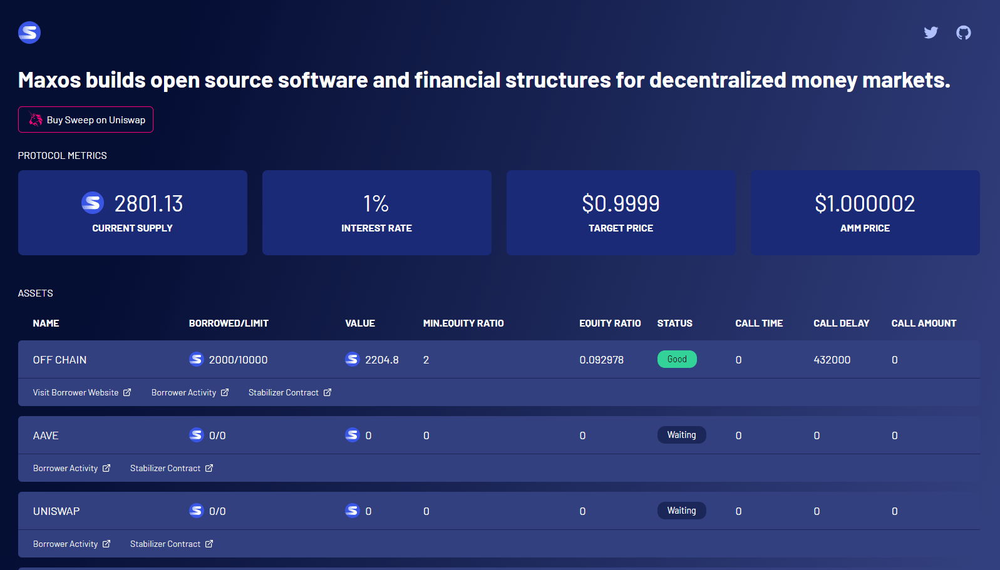

# Sweep Dashboard
[Link](https://sweepr.netlify.app/) to Sweep Dashboard

# Installation

-   Clone repo
-   Run `yarn` or `npm i`
-   Run `yarn start` or `npm run start`
-   See `http://localhost:3000/`